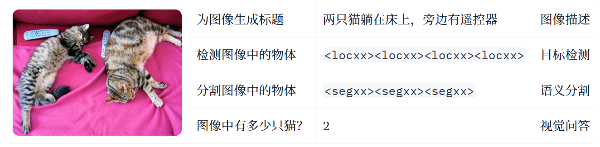
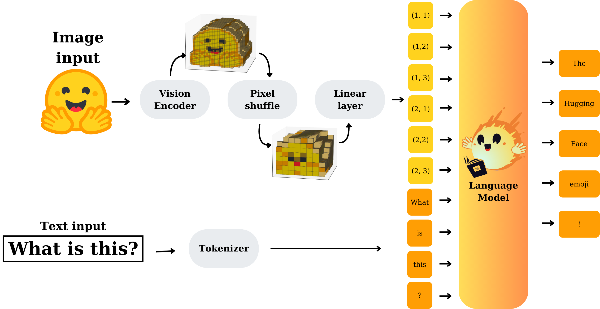
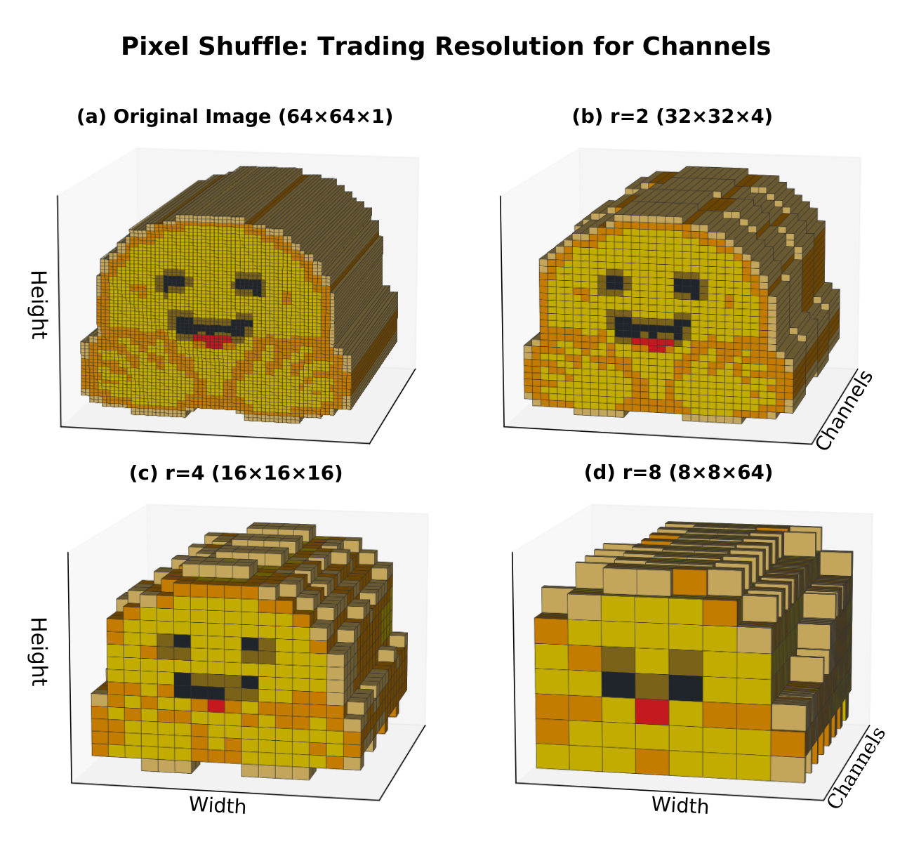

<details><summary>目录</summary><p>

- [nanoVLM](#nanovlm)
    - [什么是视觉语言模型](#什么是视觉语言模型)
    - [模型架构](#模型架构)
    - [代码库架构](#代码库架构)
        - [模型训练](#模型训练)
        - [配置](#配置)
        - [数据加载](#数据加载)
        - [模型初始化](#模型初始化)
        - [模型推理](#模型推理)
- [参考](#参考)
</p></details><p></p>

# nanoVLM

## 什么是视觉语言模型

顾名思义，视觉语言模型 (VLM) 是一种处理两种模态的多模态模型: 视觉和文本。
这些模型通常以图像和/或文本作为输入，生成文本作为输出。

基于对图像和文本 (输入) 的理解来生成文本 (输出) 是一个强大的范式。
它支持广泛的应用，从图像字幕生成和目标检测到回答关于视觉内容的问题 (如下表所示)。
需要注意的是，nanoVLM 仅专注于视觉问答作为训练目标。



## 模型架构

使用两个知名且广泛使用的架构来建模 nanoVLM：

* 视觉主干网络是标准的视觉 transformer，
  更具体地说是 [谷歌的 SigLIP 视觉编码器](https://huggingface.co/docs/transformers/en/model_doc/siglip)
* 语言主干网络遵循 [Llama 3 架构](https://huggingface.co/docs/transformers/en/model_doc/llama3)

视觉和文本模态通过 **模态投影模块** 进行对齐。该模块将 **视觉主干网络产生的图像嵌入** 作为输入，
并将它们转换为与 **语言模型嵌入层的文本嵌入** 兼容的嵌入。然后将这些嵌入连接起来并输入到 **语言解码器** 中。
**模态投影模块** 由 **像素洗牌操作** 和 **线性层** 组成。



[像素洗牌](https://huggingface.co/papers/1609.05158) 减少了图像标记的数量，
这有助于降低计算成本并加快训练速度，特别是对于对输入长度敏感的基于 transformer 的语言解码器。
下图演示了这个概念。



## 代码库架构

* models
    - `models/vision_transformer.py`：视觉主干网络(标准的视觉 Transformer)
        - Google SigLIP 视觉编码器
        - [google/siglip-base-patch16-224](https://huggingface.co/google/siglip-base-patch16-224)
        - https://huggingface.co/docs/transformers/en/model_doc/siglip
    - `models/language_model.py`：语言主干网络
        - [Llama 3](https://huggingface.co/docs/transformers/en/model_doc/llama3)
        - [HuggingFaceTB/SmolLM2-135M](https://huggingface.co/HuggingFaceTB/SmolLM2-135M)
    - `models/modality_projector.py`
        - 模态投影模块：将视觉和文本模态进行对齐

### 模型训练

```bash
$ git clone https://github.com/huggingface/nanoVLM.git
$ python train.py
```

### 配置

* `TrainConfig`
* `VLMConfig`

### 数据加载

* `get_dataloaders`

### 模型初始化

```python
from models.vision_language_model import VisionLanguageModel

model = VisionLanguageModel.from_pretrained(model_path)
```

### 模型推理

```bash
$ python generate.py
$ python generate.py --image path/to/image.png --prompt "你的提示在这里"
```


# 参考

* [视觉语言模型详解](https://huggingface.co/blog/zh/vlms)
* [视觉语言模型 (更好、更快、更强)](https://huggingface.co/blog/zh/vlms-2025)
* nanoVLM
    - Blog: [nanoVLM: The simplest repository to train your VLM in pure PyTorch](https://huggingface.co/blog/zh/nanovlm)
    - Github: [huggingface/nanoVLM](https://github.com/huggingface/nanoVLM)
    - Data: [HuggingFaceM4/the_cauldron](https://huggingface.co/datasets/HuggingFaceM4/the_cauldron)
    - Deom: [nanoVLM Image-to-Text Generator](https://huggingface.co/spaces/ariG23498/nanovlm)
* Models
    - [LlaVA: Visual Instruction Tuning](https://huggingface.co/papers/2304.08485)